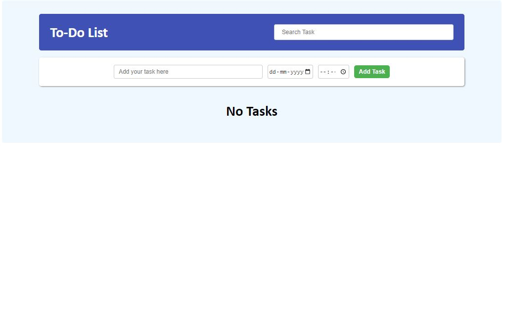
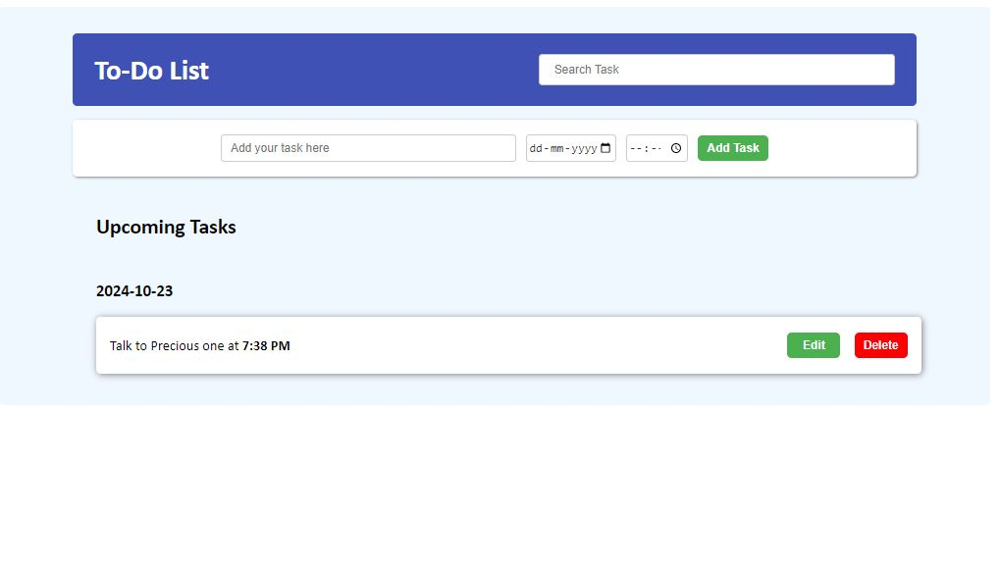
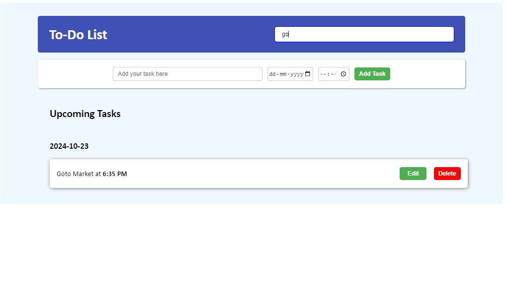
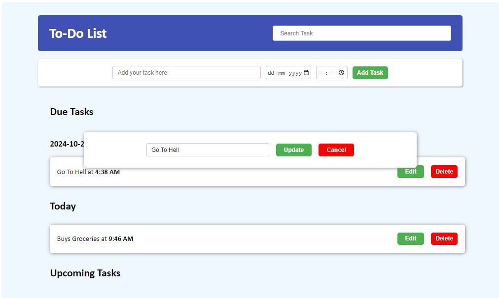
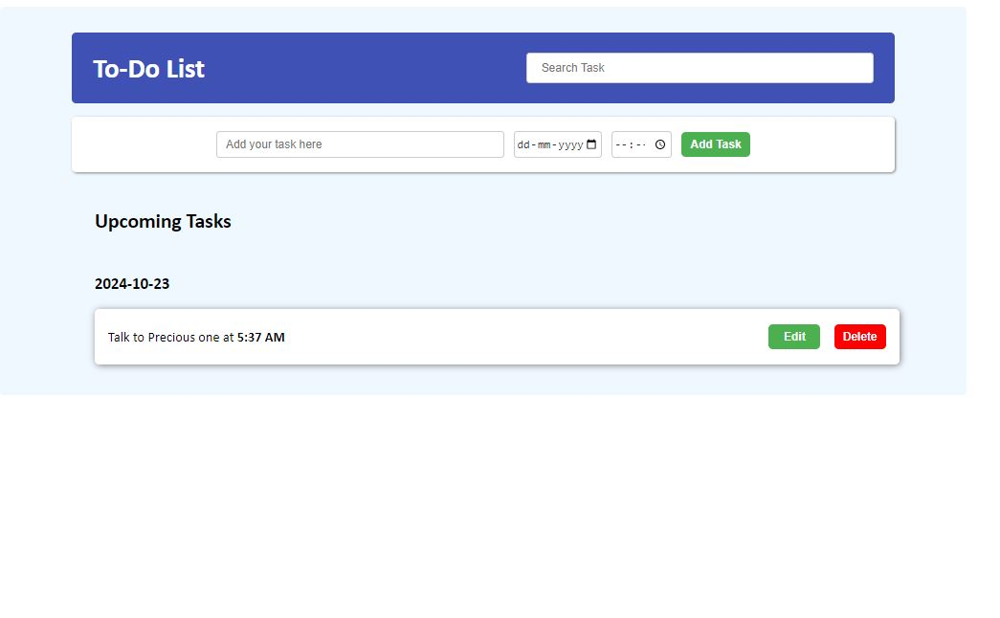
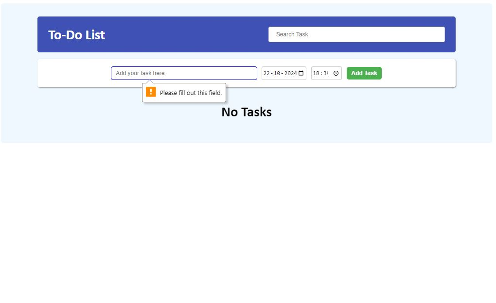

# To-Do List Application

#### The To-Do List is a web-based task management application that allows users to add, manage, and delete tasks. It saves tasks along with the selected date and time in the browser's LocalStorage, ensuring that tasks persist even after refreshing the page or closing the browser.

## Features
- **Add Tasks** : Create new tasks with a title, description, due date, and time.

- **View Tasks by Date**: Tasks are organized under headings corresponding to their due dates.

- **Edit/Delete Tasks** : Modify or remove tasks as needed.

- **Persistent Storage**: All tasks are saved in the browser’s LocalStorage, ensuring they remain between sessions.

- **Responsive Design** : Works seamlessly on desktop, tablet, and mobile devices.

---
## Technologies Used
1. **HTML** : For structuring the user interface.

2. **CSS** : For styling the layout and making the app visually appealing.

3. **JavaScript** : For handling user interaction, task management logic, and LocalStorage operations.

---

## Setup and Usage

### 1. Clone the repository to your local machine:
    `https://github.com/mahesh-ly/To-Do-List`

### 2. Open the project folder and launch the index.html file in your preferred browser.

### 3. Use the form to add tasks with a title, description, due date, and time.

### 4. View tasks under their respective due dates and manage them directly from the interface.

---
## Screenshots

#### Empty TODO List

#### Add New TODO

#### Search TODO

#### Edit TODO

#### Delete TODO

#### Compulsory Field

---

## Future Improvements

### 1. Mark as Completed.
### 2. Design can be implemented even better.
---
